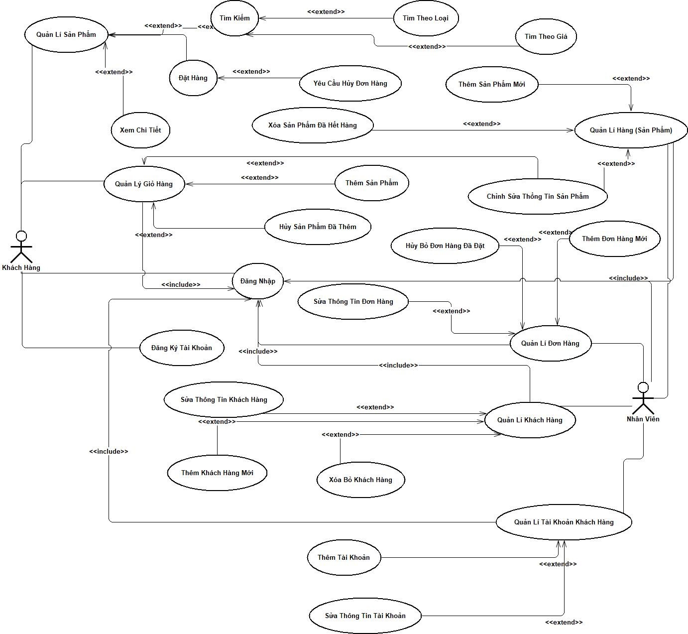
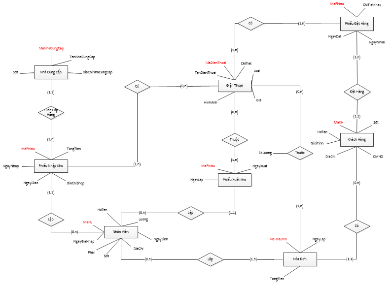
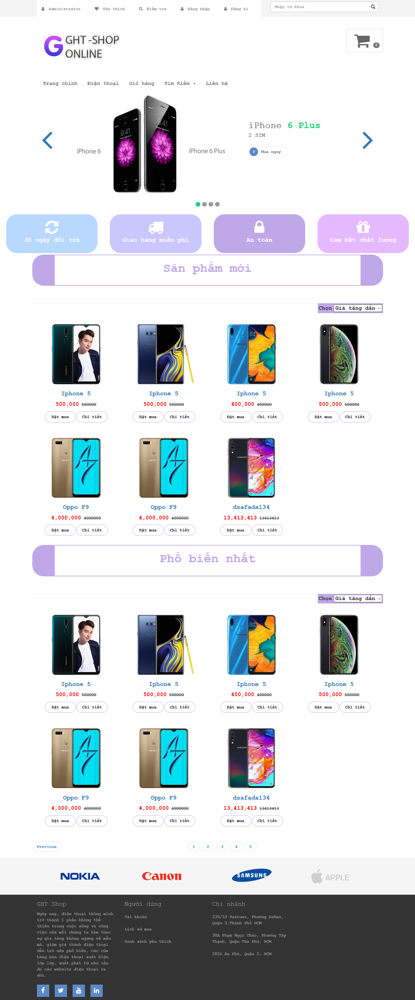
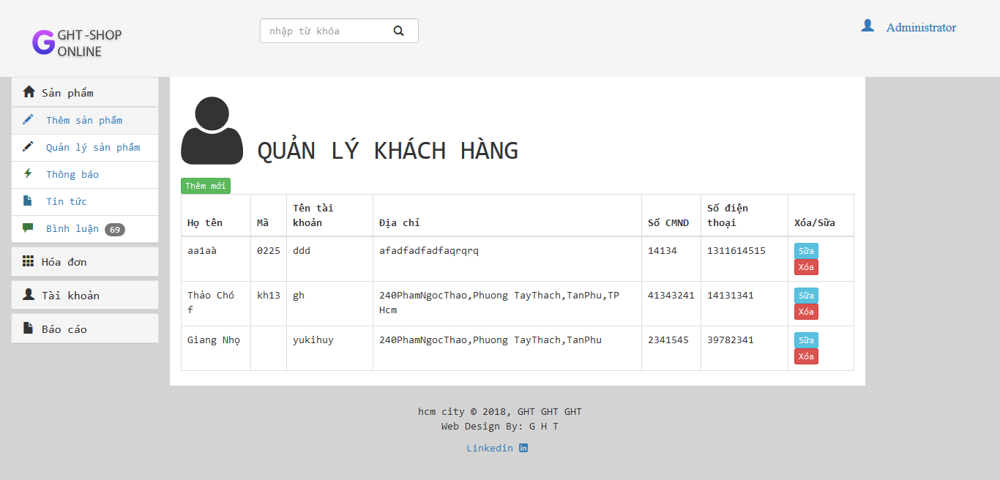
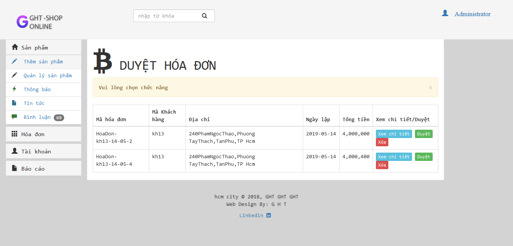
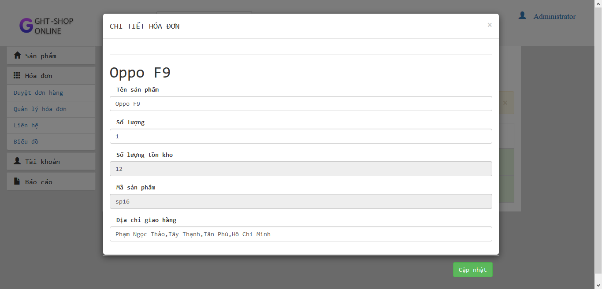

# Website thương mại điện tử

Ngày nay, điện thoại thông minh trở thành 1 phần không thể thiếu trong cuộc sống và công việc của mỗi chúng ta kèm theo sự gia tăng không ngừng về mẫu mã, giảm giá thành điện thoại dẫn trở nên phổ biến, các cửa hàng bán điện thoại xuất hiện lớp lớp, xuất phát từ nhu cầu đó các website điện thoại ra đời. Thiết kế website điện thoại chính là giải pháp toàn diện cho những doanh nghiệp mong muốn mở rộng phạm vi kinh doanh, tận dụng nguồn khách hàng trên internet để đem lại doanh thu đáng kể cho mình.

So với việc tìm kiếm 1 cửa hàng với diện tích rộng, chi phí đầu tư cơ sở vật chất cho cửa hàng, thuê nhân viên bán hàng, các chi phí phát sinh khác thì việc thiết kế website bán điện thoại di động rẻ và hiệu quả hơn hẳn. Ta chỉ cần đầu tư số vốn khá ít ỏi để thiết kế website và duy trì hàng năm thì những gì ta nhận được lớn hơn nhiều.

## Các Diagram được sữ dụng để thiết kế website
+ Use-case Diagram

+ ER Diagram

## Chức năng
-	Các yêu cầu chức năng
	- Đối với khách hàng:
    * Tìm hiểu sản phẩm
    *	Mua hàng
  	* Đặt hàng
    *	Đăng ký
    *	Đăng nhập
  - Đối với nhân viên:
  	  * Sản phẩm
	      * Thêm
        *	Xóa
        *	Sửa
  - Quản lý thông tin nhân viên:
    - Thêm mới thông tin nhân viên
    -	Xóa thông tin nhân viên
    -	Cập nhật thông tin nhân viên
  -	Quản lý thông tin khách hàng:
    -	Thêm mới thông tin khách hàng
    -	Xóa thông tin khách hàng
    -	Cập nhật thông tin khách hàng
  - Quản lý hóa đơn:
    -	Duyệt hóa đơn
    -	Xóa hóa đơn
    -	Cập nhật hóa đơn
    -	Quản lý danh mục:
    -	Thêm danh mục mới
    - Xóa danh mục
    -	Cập nhật danh mục
    -	Đăng nhập
  -	Các yêu cầu phi chức năng
    -	Đối với khách hàng:
        -	Xem thông tin sản phẩm
        -	Xem trang chủ
        -	Tìm kiểm sản phẩm
        -	Bình luận
        -	Đặt hàng
        -	Xóa sản phẩm khỏi giỏi hàng
        -	Cập nhật giỏ hàng
        -	Thêm sản phẩm giỏi hàng
    -	Đối với nhân viên:
        -	Xem thông tin sản phẩm
        -	Xem thông tin khách hàng
        -	Tìm kiếm sản phẩm
        -	Trả lời bình luận
        -	Thêm mới hóa đơn
        -	Cập nhật hóa đơn
## Công nghệ được sữ dụng:
+	Front-End: Boostrap3(Framework CSS,	Jquery(Libary Javascript)
+	Back-End PHP7 
## Giao diện người dùng

 

![DEMO](img/demo/16.png 
 
 

